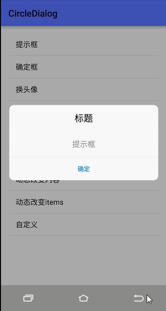

### JCenter迁移说明
 `JCenter`服务已经宣布停止维护，对于`旧版本`大家可以使用阿里云镜像引用，以后`新版本`将会发布在`JitPack`
 #### 1、旧版本阿里云镜像引用方式
 在项目根目录下的`build.gradle`文件中加入
```
 allprojects {
    repositories {
        maven { url 'https://maven.aliyun.com/repository/jcenter' }
    }
 }
```
 #### 1、新版本JitPack引用方式
 在项目根目录下的`build.gradle`文件中加入
```
 allprojects {
    repositories {
        maven { url 'https://jitpack.io' }
    }
 }
```

# Android-CircleDialog

[](https://www.apache.org/licenses/LICENSE-2.0)
[](https://bintray.com/mylhyl/maven/circleDialog/_latestVersion)
[](https://android-arsenal.com/api?level=16)

 * 基于`DialogFragment`封装，已封装的对话框类型有，常规对话框、列表框、输入框、进度框；
 每个对话框类型也支持自定义边框圆角、背景透明度、字体大小与色值
 * 初衷是掌握知识点，此库不一定适合你的产品整体风格，当然能够适合你的项目最好不过，有建议和不足之处欢迎骚扰

# 知识点
  全代码创建`shape`、`selector`、`Layout`，主要是`Drawable`所使用类如下：
  `ShapeDrawable`、`RoundRectShape`、`GradientDrawable`、`ClipDrawable`、`LayerDrawable`、`StateListDrawable`

# 效果图


# 引入
```xml
 implementation 'com.github.mylhyl:Android-CircleDialog:5.3.8'
```
如果版本号后面有-alpha，那说明最后一个版本是预览版，可能存在bug谨慎使用，稳定版则没有-alpha后缀  
例如  
稳定版：implementation 'com.mylhyl:circleDialog:x.x.x'  
预览版：implementation 'com.mylhyl:circleDialog:x.x.x-alpha'

[下载APK体验](https://www.90pan.com/b2136007)

# 使用
* [v2版本](https://github.com/mylhyl/Android-CircleDialog/tree/v2)
* [v3版本](https://github.com/mylhyl/Android-CircleDialog/tree/v3)
* [教程](https://github.com/mylhyl/Android-CircleDialog/wiki)

* [更多参数](https://github.com/mylhyl/Android-CircleDialog/tree/master/circledialog/src/main/java/com/mylhyl/circledialog/params)
* [api文档](https://mylhyl.github.io/Android-CircleDialog/)

# 注意
 * 依赖包：`appcompat-v7`、`cardview-v7`、`recyclerview-v7`
 * 继承基类`AbsBaseCircleDialog`背景为透明，自定义layout时按需求设置背景
 * v3版本开始放弃百分比适配
 * 3.0.9开始，刷新dialog界面的方法由`create`改为`refresh`
 * v4版本开始，除字体大小保持原来的`sp`单位，偏移量`px`外，其它宽、高、间距、均改为了`dp`单位
 * v5版本已经适配为`androidx`

# 联系方式
 * 可能会因为工作忙碌原因没有及时回复，请联系我的个人微信号：`48025211`

License
-------

    Copyright 2017 mylhyl

    Licensed under the Apache License, Version 2.0 (the "License");
    you may not use this file except in compliance with the License.
    You may obtain a copy of the License at

       http://www.apache.org/licenses/LICENSE-2.0

    Unless required by applicable law or agreed to in writing, software
    distributed under the License is distributed on an "AS IS" BASIS,
    WITHOUT WARRANTIES OR CONDITIONS OF ANY KIND, either express or implied.
    See the License for the specific language governing permissions and
    limitations under the License.
